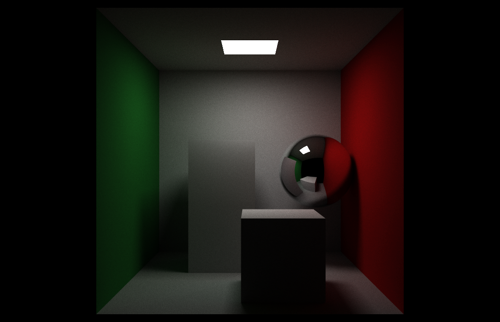

# Physically Based Rendering. Path Tracing implementation in C++

Path tracing is a complex way to compute physically based lighting.

Well-chosen **[BRDF](https://en.wikipedia.org/wiki/Bidirectional_reflectance_distribution_function)** make this approach physically correct.

# Foundation

## Rendering equation

Rendering equation describes irradiance of the surface for a given point: $L_\Theta \left(\vec{x}, \omega_\Theta \right) = L_e + \int\limits_\Omega f_r\left( \vec{x}, \omega_\Psi, \omega_\Theta \right) L_\Psi \left(\vec{x}, \omega_\Psi \right) \left( \vec{\Psi} \cdot \vec{N} \right) d\omega_\Psi$

Symbols in this equation mean:
+ $\vec{\Psi}$ ---

## Documentation
You can find documentation [here](https://ivan0sokin.github.io/path-tracing-cpp/)