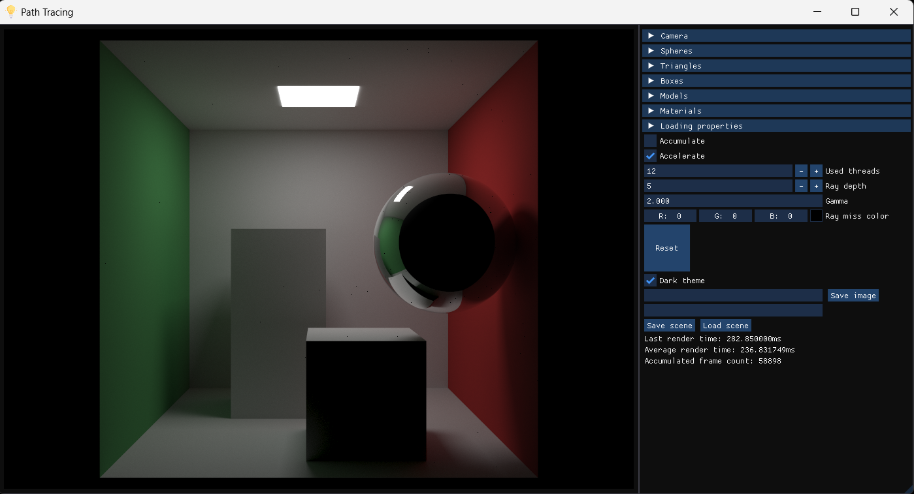

# 💡 Physically Based Rendering. Path Tracing implementation in C++

Path tracing is a complex way to compute physically based lighting.

Well-chosen **[BRDF](https://en.wikipedia.org/wiki/Bidirectional_reflectance_distribution_function)** make this approach physically correct.



# Foundation

## Rendering equation

Rendering equation describes irradiance of the surface for a given point: $$L_\Theta \left(\vec{X}, \omega_\Theta \right) = L_e\left( \vec{X}, \omega_\Theta \right) + \int\limits_\Omega f_r\left( \vec{X}, \omega_\Psi, \omega_\Theta \right) L_\Psi \left(\vec{X}, \omega_\Psi \right) \left( \vec{\Psi} \cdot \vec{N} \right) d\omega_\Psi$$

Symbols in this equation mean:
+ $\vec{\Psi}$ — incoming light direction
+ $\vec{\Theta}$ — outgoing light direction
+ $\vec{X}$ — point on surface
+ $d\omega_\Psi$ — differential of solid angle
+ $\Omega$ — hemisphere of all incoming directions for light onto surface where $\left( \vec{\Psi} \cdot \vec{N} \right) > 0$
+ $L_\Theta$ — irradiance of point on surface
+ $L_\Psi$ — radiance from light incoming from direction $\vec{\Psi}$
+ $L_e$ — light emitted from point on surface
Consider all vectors are unit.

## Monte Carlo integration

[Monte Carlo integration](https://en.wikipedia.org/wiki/Monte_Carlo_integration) tells us that integral with limits $a$ and $b$ can be computed as an average of $N$ samples multipled by length of segment $\left(a, b\right)$:

$$\int\limits_a^b f(x)dx = \left(b - a\right)\dfrac{1}{N} \sum\limits_{i=1}^{N} f(x)$$

Computers can only approximate rendering equation integral. I used Monte Carlo technique to estimate light emission value.

## BRDF

BRDF stands for Bidirectional Reflectance Distribution Function $f_r$. It tells us what how light is being reflected of a surface. According to conservation of energy law we assume that:

$$\rho = \int\limits_\Omega f_r\left( \vec{X}, \omega_\Psi, \omega_\Theta \right) \left( \vec{\Psi} \cdot \vec{N} \right) d\omega_\Psi <= 1$$

$\rho$ stands for albedo, i.e. whiteness of a surface, which is amount of light being reflected of a surface.

### Lambertian BRDF


Lambertian BRDF describes diffuse lighting and rough surfaces. Surface is rough when incoming light can be reflected in any direction in unit hemisphere along surface normal, i.e. $f_r\left( \vec{X}, \omega_\Psi, \omega_\Theta \right) = const$. 

Let's derive formula for $f_{Lambertian}$. Considering that material of surface is known, so its albedo is known.

$$
\rho = \int\limits_\Omega f_{Lambertian} \left( \vec{\Psi} \cdot \vec{N} \right) d\omega_\Psi \implies
f_{Lambertian} = \dfrac{\rho}{\int\limits_\Omega \left( \vec{\Psi} \cdot \vec{N} \right) d\omega_\Psi} \\
$$

Lets use $\phi$ and $\theta$ for spherical coordinates in unit hemisphere $\Omega$, so $d\omega_\Psi$ = $\sin\left( \theta \right) d\theta d\phi$.

$$
\int\limits_\Omega \left( \vec{\Psi} \cdot \vec{N} \right) d\omega_\Psi = \int\limits_{\phi=0}^{2\pi} \int\limits_{\theta=0}^{\frac{\pi}{2}} \sin\left( \theta \right) \cos\left( \theta \right) d\theta d\phi = \\ = \int\limits_{\phi=0}^{2\pi} d\phi \times \dfrac{1}{2} \int\limits_{\theta=0}^{\frac{\pi}{2}} \sin\left( 2\theta \right) d\theta = \\ = 2\pi \times \dfrac{2}{4} = \pi \implies f_{Lambertian} = \dfrac{\rho}{\pi}
$$

### Cook-Torrance BRDF


Matte surface can also reflect like a mirror at some angle, it is called Fresnel effect. Also there are fully reflective materials like ideal metal. In that case I have chosen Cook-Torrance BRDF. $f_{Cook-Torrance} = \dfrac{D G F}{4 \left( \vec{\Psi} \cdot \vec{N} \right) \left( \vec{\Theta} \cdot \vec{N} \right) }$, where $D$ is normal distribution function for microfacets of the surface, $G$ is geomtry shadowing factor and $F$ is Fresnel effect contribution. Cook-Torrance model describes how light interacts with microfacets of the surface.

Proof of this formula:

Let $D_N(\vec{H})$ be number of microfacets with normals parallel to vector $\vec{H}$ per surface area per solid angle. $\vec{H}$ is half-way vector:  $\vec{H} = \dfrac{\vec{\Psi} + \vec{\Theta}}{\vert \vec{\Psi} + \vec{\Theta} \vert}$. Consider all facets have area $f_a$, so total area of these microfacets is: $dA_{\perp} = f_a D_N\left( \vec{H} \right) dA \left( \vec{\Psi} \cdot \vec{H} \right) d\omega_H$.

Let's define some physical concepts:
+ Radiant flux $\Phi$ measured in Watts
+ Radiance $L = \dfrac{d^2\Phi}{dA d\omega \cos(\theta)}$ expressed in $\dfrac{\text{W}}{\text{m}^2 \text{ sr} }$
+ Irradiance of the surface $E = \dfrac{d\Phi}{dA}$ expressed in $\dfrac{\text{W}}{\text{m}^2 }$

Consider all radiant flux is reflected of a surface, so $d^2\Phi_\Theta = d^2\Phi_\Psi$

$$
L_\Psi = \dfrac{d^2 \Phi_\Psi}{dA_\perp d\omega_\Psi} \implies d^2 \Phi_\Psi = L_\Psi dA_\perp d\omega_\Psi = L_\Psi f_a D_N\left( \vec{H} \right) dA \left( \vec{\Psi} \cdot \vec{H} \right) d\omega_H d\omega_\Psi
$$

$$
L_\Theta = \dfrac{d^2 \Phi_\Theta}{dA d\omega_\Theta \left( \vec{\Theta} \cdot \vec{N} \right)} = \dfrac{d^2 \Phi_\Psi}{dA d\omega_\Theta \left( \vec{\Theta} \cdot \vec{N} \right)} = \dfrac{L_\Psi f_a D_N\left( \vec{H} \right) dA \left( \vec{\Psi} \cdot \vec{H} \right) d\omega_H d\omega_\Psi}{dA d\omega_\Theta \left( \vec{\Theta} \cdot \vec{N} \right)} =
$$

$$
= \dfrac{L_\Psi f_a D_N\left( \vec{H} \right) \left( \vec{\Psi} \cdot \vec{H} \right) d\omega_\Psi}{\left( \vec{\Theta} \cdot \vec{N} \right)} \times \dfrac{d\omega_H}{d\omega_\Theta}
$$

In spherical coordinates $\phi$ and $\theta$ we have that $d\omega_H = \sin\left( \theta \right) d\theta d\phi$ and $d\omega_\Theta = \sin\left( 2\theta \right) 2d\theta d\phi = 4\sin\left( \theta \right)\cos\left( \theta \right) d\theta d\phi$, so $\dfrac{d\omega_H}{d\omega_\Theta} = \dfrac{1}{4\cos\left( \theta \right)} = \dfrac{1}{4 \left( \vec{\Psi} \cdot \vec{H} \right)}$.

$$
L_\Theta = \dfrac{L_\Psi f_a D_N\left( \vec{H} \right) \left( \vec{\Psi} \cdot \vec{H} \right) d\omega_\Psi}{\left( \vec{\Theta} \cdot \vec{N} \right)} \times \dfrac{1}{4 \left( \vec{\Psi} \cdot \vec{H} \right)} = \dfrac{L_\Psi f_a D_N\left( \vec{H} \right) d\omega_\Psi}{4 \left( \vec{\Theta} \cdot \vec{N} \right)} \\
E_\Psi = \dfrac{d\Phi_\Psi}{dA} = L_\Psi d\omega_\Psi \left( \vec{\Psi} \cdot \vec{N} \right)
$$

$$
f_{Cook-Torrance} = \dfrac{L_\Theta}{E_\Psi} = \dfrac{L_\Psi f_a D_N\left( \vec{H} \right) d\omega_\Psi}{L_\Psi d\omega_\Psi \left( \vec{\Psi} \cdot \vec{N} \right) 4 \left( \vec{\Theta} \cdot \vec{N} \right)} = \dfrac{f_a D_N\left( \vec{H} \right)}{ 4 \left( \vec{\Psi} \cdot \vec{N} \right) \left( \vec{\Theta} \cdot \vec{N} \right)}
$$

$f_a D_N\left( \vec{H} \right)$ is area density distribution function.

For normal distribution function $D$ I used GGX version:

$$
D_{GGX}\left( \vec{H} \right) = \dfrac{\alpha^2}{\pi \left( 1 + \left( \vec{N} \cdot \vec{H} \right)^2 \left( \alpha^2 - 1 \right) \right)}
$$

Where $\alpha$ is function of roughenss (I used $\alpha = roughness^2$) 

For Geometry factor I used Smith:

$$
G_{Smith}\left( \vec{\Psi}, \vec{\Theta}, \vec{N} \right) = G_{Schlick-Beckmann}\left(\vec{\Psi}, \vec{N}\right) \times G_{Schlick-Beckmann}\left(\vec{\Theta}, \vec{N} \right) \\
G_{Schlick-Beckmann}\left(\vec{T}, \vec{N} \right) = \dfrac{ \left( \vec{N} \cdot \vec{T} \right) }{ \left( \vec{N} \cdot \vec{T} \right) \left( 1 - k \right) + k }
$$

Where $k$ is $\dfrac{\alpha}{2}$.

Good approximation for Fresnel effect contribution is given by Schlick:

$$
F_{Schlick} = F_0 + \left( 1 - F_0 \right)\left( 1 - \left( \vec{\Theta} \cdot \vec{N} \right) \right)^5
$$

### Mixed BRDF

When material is not fully rough and not enough reflective we mix BRDFs in a way that: $f_r = f_{diffuse} \left( 1 - F \right) * f_{specular} * F$. In my case specular BRDF has Fresnel factor already, so total BRDF is: $$f_r = f_{Lambertian} * \left( 1 - F \right) + f_{Cook-Torrance}$$

## Path Tracing algorithm

To understand how path tracing estimates rendering equation integral I wrote function `GetPixelColor(ray)` below in pseudo-code:
```glsl
vec3 light(0), throughput(1)
for i in 0..bounces
    payload = TraceRay(ray)
    
    if payload.t < 0
        return throughput * RayMiss(ray)

    material = payload.material
    light += material.GetEmission() * throughput
    sampledDirection = BSDF(material).Sample(ray, payload, throughtput)

    ray.origin = ray.origin + ray.direction * payload.t
    ray.direction = sampledDirection

return light
```

# 🔨 Build

For successful build you need only C++ compiler with supported C++20 standard.

```bash
git clone https://github.com/ivan0sokin/path-tracing-cpp/
cd path-tracing-cpp
cmake --build .
```

# 📄 Documentation
The documentation is generated by Doxygen and [can be found here](https://ivan0sokin.github.io/path-tracing-cpp/).

# 🔒 License
This repository is licensed under the [MIT License](LICENSE).